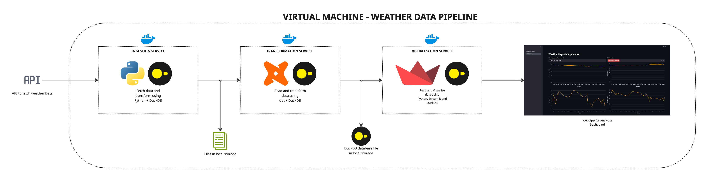

# Weather Data Pipeline with DuckDB & dbt

A data pipeline for fetching, storing, transforming and vizualizing weather observation data using DuckDB and dbt.

## 1. Introduction

### What is it?

This repository contains a configurable, end-to-end data pipeline that extracts the latest weather data from the [weather.gov API](https://api.weather.gov/), stores it in Parquet files, transforms it into consumable aggregate tables, and visualizes it on an updating cadence.

### Objective

The objective is to demonstrate the power of DuckDB for a small-scale analytics scenario at different points of the data pipeline (ingestion, transformation, and visualization).

## 2. Architecture and Current Level of Development

The current solution contains three services,
* Ingestion Service
* Transformation Service
* Visualization Service

### 2.1 Ingestion Service

All scripts required to run the `ingestion_service` are given in `./ingestion`. It contains scripts to fetch stations, zones and observations data and write them into a runtime created forlder called `./ingestion_data`. The `./ingestion/Dockerfile` contains the context to run the `ingestion_service` as a Docker container. More details in --> [Ingestion Service](to_be_added.txt)

### 2.2 Transformation Service

All scripts required to run the `transformation_service` are given in `./transformation`. It contains the automation scripts and the dbt models defined to transform then data in the ingestion layer and write them to a runtime generated DuckDB file called `./transformation/weather_reports.db`. The `./transformation/Dockerfile` contains the context to run the `transformation_service` as a Docker container. More details in --> [Transformation Service](to_be_added.txt)

### 2.3 Visualization Service

All scripts required to run the `visualization_service` are given in `./visualization`. It contains the python scrips to read from `./transformation/weather_reports.db` and then visualize the data in a Streamlit app. The `./visualization/Dockerfile` contains the context to run the `visualization_service` as a Docker container. More details in --> [Visualization Service](to_be_added.txt)

## How to use

TO BE ADDED...