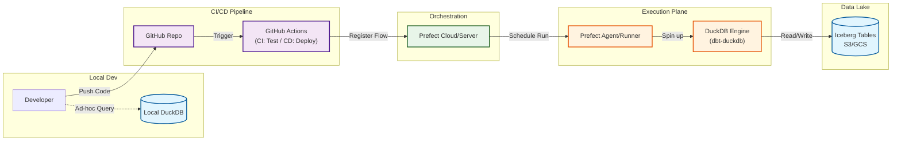

# Weather Data Pipeline with DuckDB, dbt & Apache Iceberg

[](https://www.python.org/downloads/)
[](https://python-poetry.org/)
[](https://duckdb.org/)
[](https://www.getdbt.com/)
[](https://www.prefect.io/)
[](https://iceberg.apache.org/)

Modern data pipeline demonstrating **DuckDB**, **dbt**, and **Apache Iceberg** integration with **Polaris REST catalog** support.

> 🎯 **Production-ready** data engineering project showcasing modern lakehouse architecture, workflow orchestration, and CI/CD best practices.

## Features

- ✅ **Apache Iceberg Polaris** - Production-grade REST catalog (AWS, Nessie, self-hosted)
- ✅ **Custom REST Catalog** - Educational implementation of Apache Iceberg REST spec
- ✅ **DuckDB Integration** - Native Iceberg support with DuckDB v1.4.2+
- ✅ **dbt Transformations** - Data modeling and transformations
- ✅ **Prefect Orchestration** - Production-ready workflow orchestration with scheduling
- ✅ **GitHub Actions CI/CD** - Automated testing, linting, and deployment
- ✅ **Multi-Cloud Ready** - Supports local, S3, Azure Blob Storage, GCS
- ✅ **Poetry** - Modern Python dependency management

## Quick Start

### Super Simple with Make

```bash
# 1. Setup
make setup

# 2. Start everything (Prefect UI + Catalog + Deployments)
make start

# 3. Open browser to http://localhost:4200

# 4. Run demo
make demo

# 5. Stop when done
make stop
```

### Common Make Commands

```bash
# Data Operations
make fetch-all      # Fetch all weather data
make dbt-all        # Run all dbt tasks

# Individual Flows
make run-weather    # Weather ingestion only
make run-dbt        # dbt transformations only
make run-pipeline   # Complete pipeline

# Development
make lint           # Run linting
make format         # Format code
make test           # Run tests

# Cleanup
make clean          # Stop servers + cleanup
make clean-data     # Delete warehouse data (WARNING!)
```

Run `make help` to see all available commands.

### Alternative: Manual Commands

<details>
<summary>Click to expand manual setup instructions</summary>

#### 1. Install Dependencies
```bash
poetry install
```

#### 2. Start REST Catalog Server
```bash
poetry run catalog-server
```

#### 3. Run Demo
```bash
poetry run python examples/test_catalog.py
```

#### 4. Fetch Real Weather Data (Optional)
```bash
poetry run fetch-stations
poetry run fetch-observations
poetry run load-observations
```

#### 5. Run dbt Transformations
```bash
poetry run dbt run --project-dir dbt --profiles-dir dbt
poetry run dbt test --project-dir dbt --profiles-dir dbt
```

#### 6. Orchestration with Prefect
```bash
# Start Prefect server
poetry run prefect server start

# Run flows
poetry run python src/flows/weather_ingestion.py
poetry run python src/flows/dbt_transformations.py
```

</details>

### For Production: Using Apache Iceberg Polaris

The above quick start uses a local catalog. For production deployments, use **Apache Iceberg Polaris** (managed or self-hosted REST catalog):

**See [POLARIS_SETUP.md](POLARIS_SETUP.md) for detailed instructions:**
- ✅ AWS managed Polaris service
- ✅ Self-hosted Polaris deployment
- ✅ Nessie (alternative REST catalog)
- ✅ Multi-cloud storage configuration (S3, Azure, GCS)

## Project Structure

```
duckdb-dbt/
├── .github/workflows/           # CI/CD pipelines
│   ├── ci.yml                   # Main CI workflow
│   └── dbt.yml                  # dbt validation
├── config/                      # Application configuration
│   └── storage.yaml            # Multi-backend storage config
├── dbt/                         # dbt configuration & models
│   ├── dbt_project.yml         # dbt project configuration
│   ├── profiles.yml            # dbt profiles
│   └── models/                 # dbt transformations
│       ├── staging/            # Staging models
│       └── marts/              # Business logic models
├── docs/                        # Documentation
│   ├── README.md               # User guide (this file)
│   └── CLAUDE.md               # Technical deep-dive
├── scripts/                     # Utility scripts
│   ├── deploy_flows.py         # Prefect deployment script
│   └── run_with_ui.sh          # UI runner script
├── src/                         # Source code
│   ├── catalog/
│   │   └── rest_server.py      # Custom Iceberg REST catalog
│   ├── ingestion/
│   │   ├── config.py           # Configuration management
│   │   ├── iceberg_manager.py  # DuckDB Iceberg integration
│   │   ├── fetch_stations.py   # Weather station fetcher
│   │   ├── fetch_observations.py # Weather data fetcher
│   │   └── write_observations.py # Data loader
│   └── flows/                  # Prefect orchestration flows
│       ├── demo_flow.py        # Demo flow
│       ├── weather_ingestion.py # Data ingestion flow
│       ├── dbt_transformations.py # dbt flow
│       └── main_pipeline.py    # Complete pipeline
├── examples/
│   └── test_catalog.py         # Demo script
├── prefect.yaml                 # Prefect deployments
├── pyproject.toml               # Poetry dependencies
├── Makefile                     # Build automation
└── warehouse/                   # Iceberg data lake (gitignored)
```

## Configuration

Edit `config/storage.yaml` to configure storage backends and catalog settings:

```yaml
# Storage: local, s3, azure, gcs
storage:
  backend: local

# Table format: duckdb or iceberg
table_format: iceberg

# Iceberg REST catalog
iceberg:
  catalog:
    type: rest
    uri: http://localhost:8181
```

## Commands

```bash
# Start catalog server
poetry run catalog-server

# Fetch weather data
poetry run fetch-stations
poetry run fetch-observations

# Load data to Iceberg
poetry run load-observations

# Run dbt
poetry run dbt run --project-dir dbt --profiles-dir dbt
poetry run dbt test --project-dir dbt --profiles-dir dbt
```

## What's Inside

### Custom REST Catalog

A complete implementation of the Apache Iceberg REST Catalog specification:
- Namespace management (create, list, delete)
- Table operations (create, read, update, delete)
- Proper schema conversion (REST ↔ PyIceberg)
- Complex type handling (lists, structs, maps)
- Snapshot and metadata management

### Iceberg Table Format

Real Iceberg tables with proper structure:
```
warehouse/
└── weather_data.db/
    └── observations/
        ├── data/
        │   └── *.parquet          # Data files
        └── metadata/
            ├── *.metadata.json    # Schema + snapshots
            └── *.avro             # Manifests
```

### dbt Models

**Staging Layer:**
- **stg_observations** - Cleaned weather observations from source

**Marts Layer:**
- **fact_observations** - Enriched observations with temporal attributes
- **fact_daily_weather** - Daily weather aggregates by station
- **dim_stations** - Station dimension table
- **extreme_weather_events** - Statistical anomaly detection (Z-score based)

## Architecture



## Orchestration & Deployment

This project includes production-ready orchestration using **Prefect** and CI/CD with **GitHub Actions**.

### Prefect Flows

Four pre-configured workflows available on-demand or scheduled:
- **Demo Flow** - Simple demonstration of Prefect features
- **Weather Ingestion** - Fetches and loads weather data
- **dbt Transformations** - Runs dbt models and tests
- **Complete Pipeline** - End-to-end data pipeline

### GitHub Actions

Automated workflows for:
- ✅ Code quality (Ruff linting & formatting)
- ✅ Type checking (mypy)
- ✅ Testing (pytest with coverage)
- ✅ dbt validation (compile, parse, test)

## Learn More

See [CLAUDE.md](CLAUDE.md) for:
- Iceberg architecture deep-dive
- REST catalog implementation details
- Prefect orchestration & deployment
- GitHub Actions CI/CD setup
- Production deployment guide
- Troubleshooting & best practices

## Contributing

Contributions are welcome! Please read [CONTRIBUTING.md](../CONTRIBUTING.md) for:
- Development setup
- Code style guidelines
- Pull request process
- Testing requirements

## Project Highlights

✨ **What makes this project special:**

- **Custom REST Catalog**: Full implementation of Apache Iceberg REST spec
- **Production Orchestration**: Prefect with on-demand and scheduled flows
- **Modern Stack**: DuckDB 1.4.2+ with native Iceberg support
- **CI/CD Pipeline**: GitHub Actions for automated testing and validation
- **Clean Architecture**: Modular structure for easy contribution
- **Comprehensive Docs**: Both user guides and technical deep-dives

## Use Cases

This project demonstrates patterns for:
- Building data lakehouses with Apache Iceberg
- Implementing custom Iceberg catalogs
- Orchestrating data pipelines with Prefect
- Using dbt for data transformations
- Integrating DuckDB with Iceberg
- CI/CD for data pipelines

## Resources

- [Apache Iceberg](https://iceberg.apache.org/)
- [DuckDB Iceberg Extension](https://duckdb.org/docs/extensions/iceberg)
- [dbt Documentation](https://docs.getdbt.com/)
- [PyIceberg](https://py.iceberg.apache.org/)
- [Prefect Documentation](https://docs.prefect.io/)

## License

MIT License - feel free to use this project for learning and commercial purposes.

---

**Built with ❤️ for the data engineering community**

*If you find this project helpful, please consider giving it a ⭐ on GitHub!*